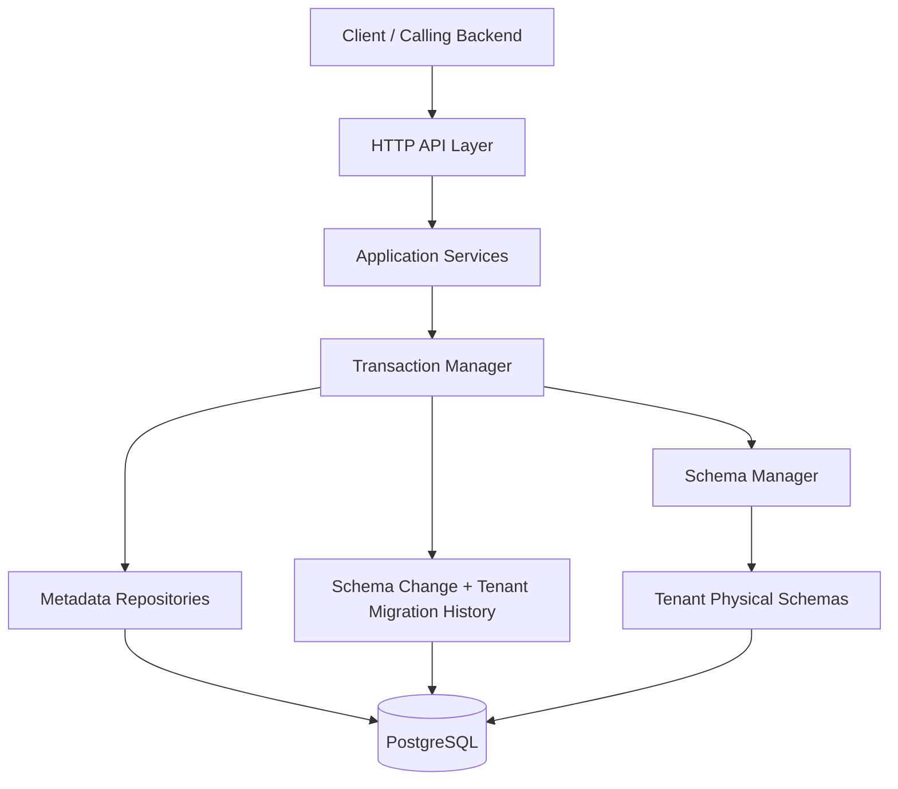
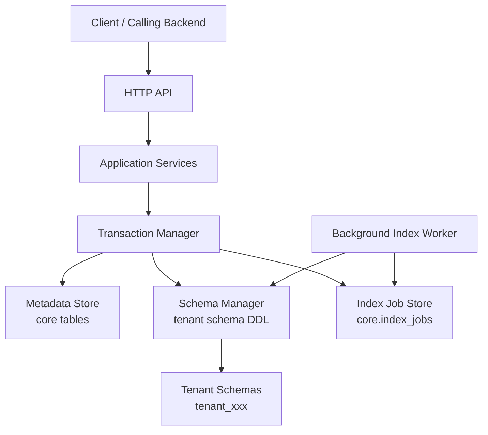
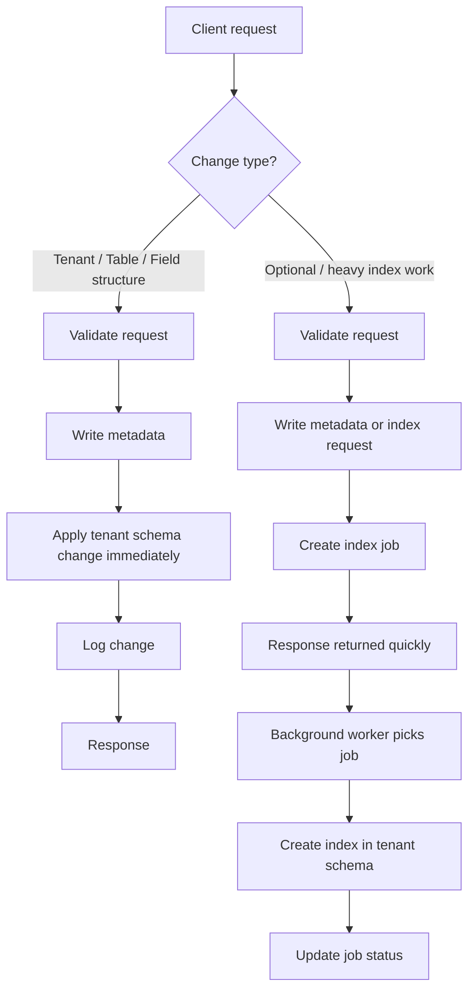

# Data Model Service Architecture

This document gives a simplified architectural view of the standalone data model service in `new/backend/data-model-service`.

It covers:

- the current service architecture
- a proposed hybrid architecture for selective async index work
- the high-level request flow

The goal is to show how the service is structured without dropping into low-level implementation detail.

## Purpose

The service owns two closely related concerns:

1. metadata about the logical data model
2. physical tenant schemas in PostgreSQL

The metadata side describes tenants, tables, fields, links, pivots, options, and change history.

The physical side contains the actual tenant schemas and tables where the data model is materialized.

The current implementation is designed so that structural model changes such as tenant provisioning, table creation, and field creation happen immediately as part of the request flow.

## Current High-Level Architecture

This diagram shows the current core shape of the service.

## Explanation Of The Current Architecture

### Client / Calling Backend

This is the external system that calls the data model service over HTTP.

Examples:

- create a tenant
- provision a tenant schema
- create a table
- create a field
- read the assembled data model

### HTTP API Layer

The API layer exposes the service endpoints and translates HTTP requests into service calls.

Its job is to:

- parse input
- validate route and payload format
- call the correct service method
- return response payloads

This layer should remain transport-focused and should not own schema logic directly.

### Application Services

The service layer contains the business workflow for each operation.

Examples:

- `TenantService`
- `TableService`
- `FieldService`
- `LinkService`
- `PivotService`
- read services for assembled data model access

This layer coordinates validation, metadata persistence, physical schema mutation, and change logging.

### Transaction Manager

The transaction manager is the consistency boundary for write operations.

Its job is to make one logical operation behave as one unit of work.

For example, on table creation it can coordinate:

- metadata insert for the table
- physical table creation in the tenant schema
- insertion of default fields
- unique index creation on `object_id`
- schema change logging
- tenant schema migration history recording

If one of those steps fails, the operation should not partially succeed.

### Metadata Repositories

The metadata repositories persist the logical model inside the shared metadata schema.

These repositories manage records such as:

- tenants
- model tables
- model fields
- links
- pivots
- table options

This is the authoritative logical view of the model.

### Schema Manager

The schema manager is responsible for physical DDL against the tenant schemas.

Typical responsibilities:

- create tenant schema
- create physical table
- add physical column
- drop physical column
- drop physical table
- create or drop physical indexes

This is the boundary between logical metadata and actual tenant PostgreSQL structure.

### Schema Change And Tenant Migration History

The service also records operational history for traceability.

This includes:

- schema change log entries
- tenant schema migration rows

This history is useful for:

- auditing what changed
- understanding failures
- reconciliation and repair flows later

### PostgreSQL And Tenant Physical Schemas

The service uses PostgreSQL for both metadata and tenant physical schemas.

At a high level:

- shared metadata lives in `core.*`
- each tenant has its own schema such as `tenant_<uuid>`

This means the tenancy model is schema-based, not row-based.

## Proposed Hybrid Architecture For Selective Async Index Work

The current architecture is a good fit for structural schema changes.  
A useful extension is to keep structural changes synchronous while allowing optional or heavy index work to run asynchronously.

This is the proposed high-level architecture for that hybrid model.

## Explanation Of The Hybrid Extension

The important idea is that not all changes are equal.

### Structural Changes Stay Synchronous

These should remain immediate:

- tenant creation
- tenant provisioning
- table creation
- field creation
- field deletion
- table deletion
- required base indexes such as `object_id`

These are core shape changes in the data model.  
They should complete as part of the request so the service stays strongly consistent.

### Heavy Or Optional Index Work Can Be Async

These are better candidates for background execution:

- navigation indexes
- search indexes
- large composite indexes
- index rebuilds
- repair or reconciliation index jobs

These operations are often slower and less fundamental to the immediate correctness of the model.

### Index Job Store

The index job store is where pending async index work is recorded.

A job row would typically contain:

- tenant id
- table name
- columns
- index type
- status
- timestamps
- error details if failed

This turns index creation into a managed background process instead of blocking the request.

### Background Index Worker

The worker reads pending index jobs and applies the corresponding physical DDL using the schema manager.

At a high level it would:

1. load a pending job
2. mark it running
3. create the index in the tenant schema
4. mark it applied or failed

This follows the useful part of Marble's async index pattern without moving the entire schema system to eventual consistency.

## High-Level Flow

The following flow shows the simplified behavior of the service with the proposed hybrid split.

## Explanation Of The Flow

### Structural Request Path

For structural model changes, the request path is direct.

The service:

- validates the request
- writes or updates metadata
- applies the tenant schema change immediately
- records change history
- returns the response

This path is best for operations that define the model itself.

### Async Index Path

For optional index work, the request path is shorter.

The service:

- validates the request
- persists the relevant metadata or index intent
- creates an index job
- returns quickly

Then the background worker completes the physical index creation later.

This improves responsiveness for expensive index work while keeping the core model lifecycle synchronous.

## Why This Split Is Useful

This split gives the service two strong properties at once.

### Strong Consistency For Core Model Shape

The service remains authoritative for:

- tenant existence
- table existence
- field existence
- physical schema shape

This avoids drift between metadata and physical structure for the most important operations.

### Operational Flexibility For Heavy Indexing

The service also gains room for:

- long-running index builds
- retries
- failure recovery
- non-blocking API behavior

That gives the service a practical operational model without importing unnecessary complexity into every request.

## Recommended Design Direction

The recommended direction is:

- keep the current synchronous structural schema mutation model
- add selective async handling only for non-critical or expensive index work

This preserves the strengths of the current standalone service while borrowing the most useful background-processing pattern from Marble.

