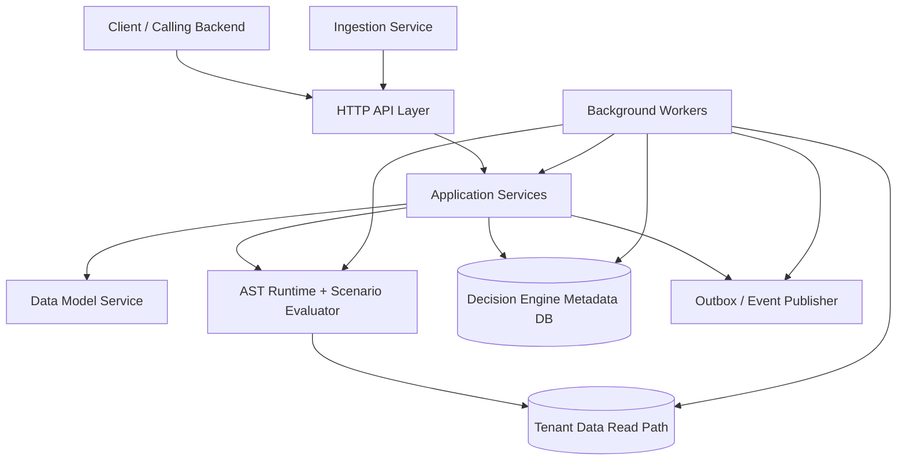
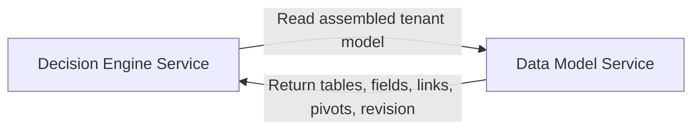
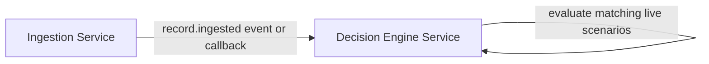
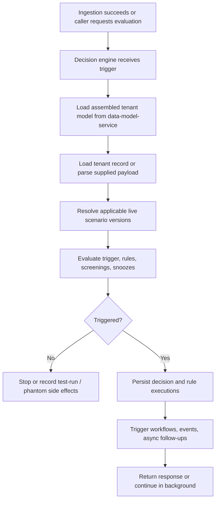

# Decision Engine Service Architecture

This document gives a simplified architectural view of the standalone decision engine service in `new/backend/decision-engine-service`.

It covers:

- the intended service architecture
- how the service integrates with `data-model-service`
- how the service integrates with `ingestion-service`
- the high-level execution flow

The goal is to show how the service should fit into the new backend split without dropping into low-level implementation detail.

## Purpose

The service owns Marble's decisioning domain.

That means it is responsible for:

1. authoring executable scenarios and rules
2. validating and publishing executable versions
3. evaluating scenarios against tenant records or payloads
4. persisting decisions and execution history
5. coordinating decision-side workflows, scheduling, async execution, and related side effects

This is broader than a simple rule evaluator.

The service should become the execution authority in the new architecture, while `data-model-service` remains the schema authority and `ingestion-service` remains the write authority.

## Current High-Level Architecture

This diagram shows the intended core shape of the service inside the new split architecture.

## Explanation Of The Current Architecture

### Client / Calling Backend

This is the external system that calls the decision engine service over HTTP or internal service APIs.

Examples:

- create a scenario
- create a scenario iteration
- validate an iteration
- publish a live version
- trigger a decision evaluation
- inspect decisions, test runs, or async execution state

### Ingestion Service

`ingestion-service` remains the owner of record intake and writes.

Its role in this architecture is to trigger decision evaluation after successful ingestion.

That can happen through:

- an event such as `record.ingested`
- or an explicit callback/API request to the decision engine

The decision engine should not become the primary record-write path.

### Data Model Service

`data-model-service` remains the owner of tenant schema truth.

Its role is to provide the assembled tenant model contract that the decision engine needs for:

- field typing
- trigger-object validation
- links and navigation
- pivots
- model revision awareness
- preparation-related metadata when applicable

The decision engine should not directly own table, field, pivot, or link authoring.

### HTTP API Layer

The API layer exposes the service endpoints and translates HTTP requests into service calls.

Its job is to:

- parse input
- validate route and payload shape
- call the correct service method
- return response payloads

This layer should remain transport-focused and should not own execution logic directly.

### Application Services

The service layer contains the business workflow for decisioning operations.

Examples:

- scenario service
- iteration service
- publication service
- validation service
- decision service
- test-run service
- scheduled execution service
- async execution service
- workflow service

This layer coordinates persistence, validation, runtime execution, integration calls, and background work handoff.

### AST Runtime And Scenario Evaluator

This is the executable core of the service.

It is responsible for:

- AST evaluation
- trigger execution
- concurrent rule execution
- threshold mapping
- screening-aware evaluation
- snooze-aware suppression
- phantom/test-run evaluation

This runtime should remain a clear internal module, separate from transport and storage concerns.

### Background Workers

Some parts of Marble's current behavior are not purely request/response.

The worker side is expected to handle:

- scheduled execution
- async batch execution
- test-run summary generation
- optional webhook/outbox relay
- optional evaluation offloading maintenance
- optional screening follow-up or match enrichment coordination

This keeps long-running or retryable work out of the synchronous API path.

### Decision Engine Metadata DB

This is the service-owned persistence layer for decisioning metadata and history.

It should hold data such as:

- scenarios
- scenario iterations
- rules
- rule snoozes
- publications
- scenario test runs
- phantom decisions
- decisions
- rule executions
- scheduled executions
- async decision executions
- workflow definitions
- outbox or event records if retained locally

This database is the system of record for decision history and decision-engine configuration.

### Tenant Data Read Path

The decision engine needs read access to tenant records at execution time.

This is required for functions such as:

- payload access
- database lookups
- aggregate reads
- pivot-aware navigation
- past-alert checks
- scheduled candidate scans

In V1, this may be direct PostgreSQL tenant-schema reads.

Even if that is the case, it should still sit behind a clear internal read abstraction.

### Outbox / Event Publisher

Marble's decisioning flow currently creates decision-related and workflow-related side effects.

In the extracted architecture, those effects should go through an explicit boundary such as:

- a local outbox
- an event publisher
- or a dedicated webhook/event integration adapter

This boundary is where the service hands off:

- `decision.created`
- async execution failure events
- workflow-generated case or webhook events

## Integration With `data-model-service`

The decision engine depends on `data-model-service` for model truth.

### Why This Dependency Exists

The decision engine needs model data for:

- AST dry-run validation
- trigger-object validation
- runtime typing
- path navigation
- pivot resolution
- workflow AST validation
- evaluation consistency against a known model revision

### Design Rule

The decision engine should consume model contracts, not shared internal database knowledge from the old monolith.

## Integration With `ingestion-service`

The decision engine depends on `ingestion-service` for write completion signals.

### Why This Dependency Exists

In the new architecture, ingestion owns:

- payload intake
- normalization
- schema validation for writes
- record persistence

The decision engine should respond after that work succeeds.

### Design Rule

The decision engine should not replace ingestion.

It should evaluate records after ingestion, or evaluate explicit payloads only when a deliberate API path requires that behavior.

## High-Level Flow

The following flow shows the simplified behavior of the service in the new split architecture.

## Explanation Of The Flow

### Trigger Reception

The service is activated either:

- after ingestion
- by a direct evaluation request
- by a scheduled execution worker
- by an async batch execution worker

### Model Resolution

Before evaluation, the service resolves the current tenant model contract from `data-model-service`.

This keeps typing and navigation logic aligned with the schema authority.

### Payload Or Record Resolution

The service then obtains the actual evaluation subject.

That may be:

- an already-ingested tenant record
- or a raw payload that must be parsed and enriched

### Scenario Resolution

The service identifies which live scenarios apply to the trigger object type and execution context.

This uses service-owned scenario metadata, not the data model service.

### Evaluation

The runtime evaluates:

- trigger AST
- rules
- score accumulation
- screening logic where applicable
- snooze state
- thresholds and final outcome

This is the core execution step.

### Persistence And Side Effects

If evaluation produces a decision, the service persists:

- decision metadata
- rule executions
- screenings where applicable
- phantom/test-run records when needed

Then it coordinates downstream side effects such as:

- workflow processing
- case-related actions if retained here
- event or webhook handoff

## Why This Split Is Useful

This split gives the new backend architecture a cleaner separation of concerns.

### Data Model Service Stays Focused On Schema Truth

It remains authoritative for:

- table and field structure
- links and pivots
- tenant provisioning
- schema-change history

### Ingestion Service Stays Focused On Writes

It remains authoritative for:

- data intake
- normalization
- persistence of tenant records

### Decision Engine Service Becomes Execution Authority

It becomes authoritative for:

- executable scenario versions
- decision outcomes
- rule execution history
- scheduling and async execution
- decision-side orchestration

## Recommended Design Direction

The recommended direction is:

- keep `data-model-service` as schema authority
- keep `ingestion-service` as write authority
- make `decision-engine-service` the decisioning authority

The integration style should be:

- contract-based with `data-model-service`
- event-driven or callback-driven from `ingestion-service`
- explicit internal abstractions for tenant-data reads and side effects

This preserves the strengths of the new split architecture while extracting Marble's full decisioning behavior into a dedicated bounded context.
